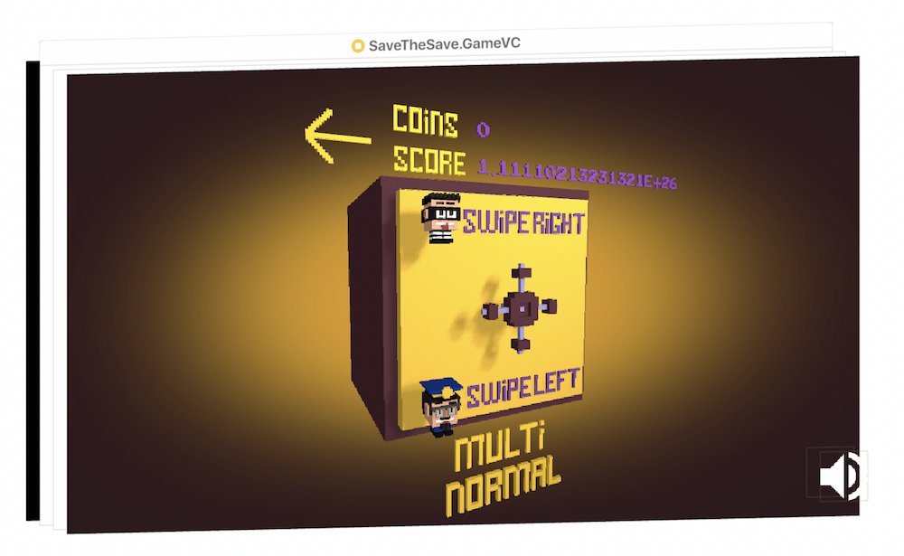

# SafeTheSafe
.

Safe The Safe is a game in which you play as a thief or a cop. You search in the city for a lost Safe. You also can play it with your friend. One will be the thief and the other is the cop. Both trying to find the safe first. Who ever get it first will win. So enjoy the game and Safe the Safe.

# Who Am I? and Why?

Hi, 
I am Moaz. Welcome to my game. Before I talk about the the game. I must introduce  myself properly. I am in my Last year in Alexandria University Computer and Communications department. I love Programming specially on Apple's eco system. 
The idea of this game came to me when I saw a book for Ray Wenderlich who had a book "how to make 3D game on swift" so I got very excited.
When I first made this game I wanted to do a finished product as a game but I have had many difficulties in this Process. I basically rebuild this game lots of time because my understanding to certain concepts of SceneKit as well as Game Design was not clear at first. The second reason there were lots of bugs in Xcode 8.3 and it's transition to Xcode 9.0 this was a huge problem for me. 
I intend to make this a single or multiplayer game with ARKit but after a while I got frustrated and I wanted to release it any way as a beta and I hope I will find the strength to continue it over time. 
I can't deny when I thought about this game I was intended to sell it or gain money from it. but as you hopefully did not notice the game is far from finish. But despite the agony, I have learned lots about making a 3d Game with sceneKit and I am now confident in my self to continue this game and build another games with ARKit and SceneKit. Please Feel free to try it Feedbacks are really appreciated.

# App Store Link.
Get it On the [App Store](https://itunes.apple.com/us/app/safe-the-safe/id1428057459?ls=1&mt=8).

# ScreenShots.

.

